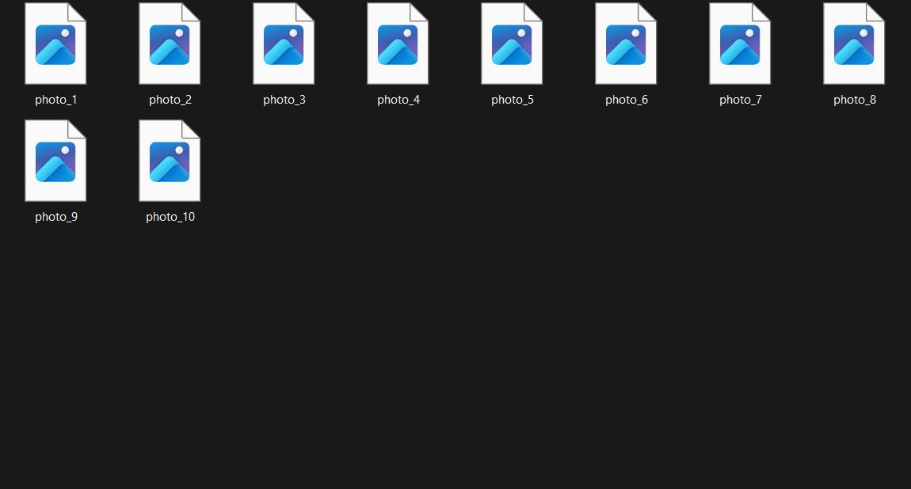

# Bulk File Renamer  
This is a Python script that batch renames files in a folder using a custom prefix and file extension filter. It also supports a `--dry-run` mode to preview changes before applying them.

Este es un script en Python que renombra archivos por lotes en una carpeta usando un prefijo personalizado y un filtro por extensión. También incluye un modo `--dry-run` para simular los cambios antes de aplicarlos.

## See demo below:

---

## BUY

## How to Use

1. nstall dependencies  

pip install -r requirements.txt

2. Run the script

python renamer.py --carpeta ./demo --prefijo img_ --extension .jpg

3. Preview changes without applying them

python renamer.py --carpeta ./demo --prefijo img_ --extension .jpg --dry-run

## Cómo usarlo

1. Instala los requisitos

pip install -r requirements.txt

2. Ejecuta el script

python renamer.py --carpeta ./demo --prefijo img_ --extension .jpg

3. Simula los cambios sin aplicarlos

python renamer.py --carpeta ./demo --prefijo img_ --extension .jpg --dry-run

## Output
The script renames matching files with the specified prefix and keeps the original extension. In dry-run mode, it only displays the planned changes.

El script renombra los archivos coincidentes con el prefijo indicado y mantiene la extensión original. En modo dry-run, solo muestra los cambios planeados.

See the demo/ folder for an example.
Consulta la carpeta demo/ para ver un ejemplo.

## CLI Arguments

Argument	Description	Descripción (ES)
--carpeta	Folder with the files to rename	Carpeta con los archivos a renombrar
--prefijo	Prefix to add at the start of each filename	Prefijo para añadir al principio del nombre
--extension	Only rename files with this extension	Renombrar solo archivos con esta extensión
--dry-run	Preview changes without renaming files	Simular sin aplicar cambios

## Requirements
Python 3.8 or higher
Standard libraries only (no external dependencies)

Requiere Python 3.8 o superior
Solo usa librerías estándar (no requiere instalar extras)

## License
MIT License. You’re free to use, modify, and share it.
Licencia MIT. Puedes usarlo, modificarlo y compartirlo libremente.

## Author
Created by @thegarciastudio 

Creado por @thegarciastudio# bulk-file-renamer
